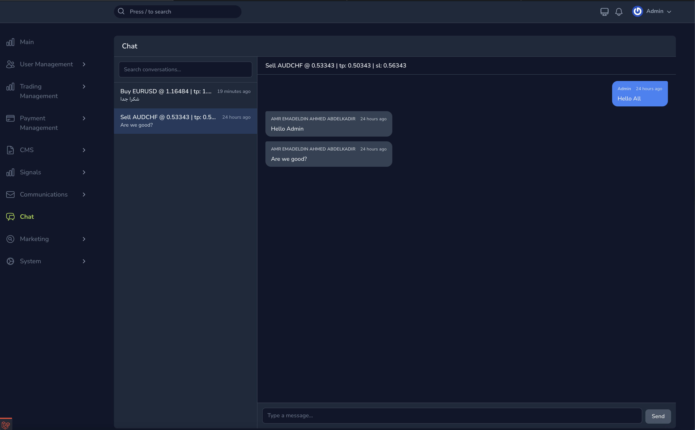
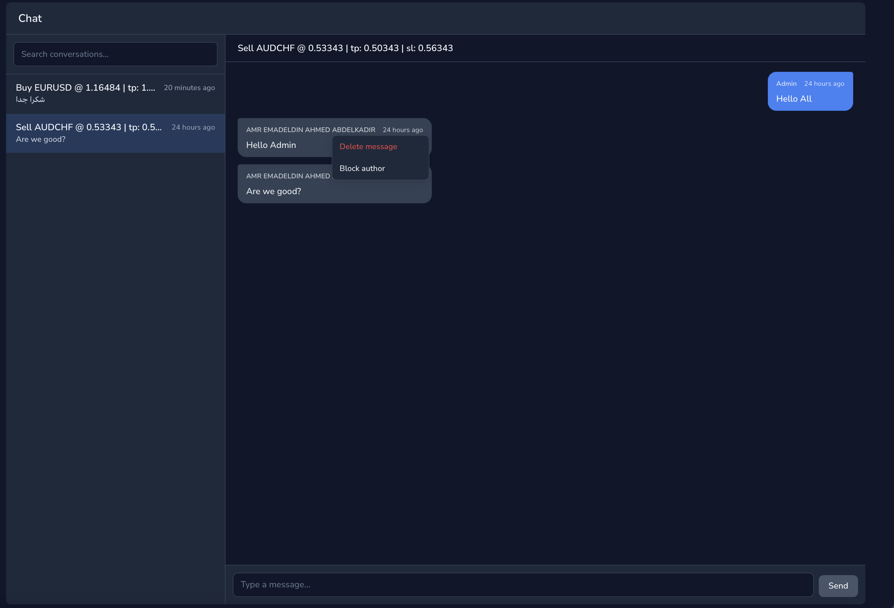

# Changelog

All notable changes to `asciisd/nova-chat` are documented in this file.

The format is based on [Keep a Changelog](https://keepachangelog.com/en/1.1.0/),
and this project follows [Semantic Versioning](https://semver.org/spec/v2.0.0.html).
Earlier history (`v0.1.x`) is reconstructed from git tags and commits.

## [1.0.1] — 2026-05-12

### Fixed

- The `nova_chat_blocked_participants` migration auto-generated a
  composite index name (`nova_chat_blocked_participants_blocked_by_type_blocked_by_id_index`,
  67 chars) that exceeded MySQL's 64-character identifier cap, causing
  `php artisan migrate` to fail with `SQLSTATE[42000] 1059 Identifier
  name … is too long`. The migration now passes an explicit short index
  name (`nova_chat_blocked_by_idx`).
- The publishable stub `database/stubs/chat_messages_table.stub` and the
  `nova-chat:make-table` generator now emit an explicit
  `<table>_deleted_by_idx` index name instead of relying on
  `nullableMorphs()`'s auto-generated 33-char-suffix default. This keeps
  generated migrations safe even when the host table name is long
  (e.g. `customer_support_request_messages`).

### Recovering from the v1.0.0 failure

If you upgraded to `v1.0.0` and `php artisan migrate` failed mid-way on
the blocks table, MySQL created the table but rejected the index, and
Laravel did **not** record the migration as run. Recover with:

```sql
DROP TABLE nova_chat_blocked_participants;
```

Then `composer update asciisd/nova-chat` to pull `v1.0.1` and run
`php artisan migrate` again.

## [1.0.0] — 2026-05-12

First stable release. The contracts, wire format, and configuration keys
are now considered public surface; future breaking changes will require a
major-version bump.




### Added

- **Admin moderation — global participant blocks.**
  - New package-owned table `nova_chat_blocked_participants`, auto-loaded
    via `loadMigrationsFrom()` (no `vendor:publish` step needed).
  - `Asciisd\NovaChat\Models\BlockedParticipant`,
    `Asciisd\NovaChat\Support\BlockList` (singleton, per-request memoized),
    and `Asciisd\NovaChat\Http\Controllers\BlockedParticipantsController`
    backing the new admin endpoints.
  - `ChatParticipant::isChatBlocked(): bool` — default trait
    implementation in `AsChatParticipant` reads from `BlockList`. Consumers
    must gate their user-side write endpoint on this check; the package's
    admin POST is unaffected.
  - New routes:
    - `GET /nova-vendor/nova-chat/blocks`
    - `POST /nova-vendor/nova-chat/blocks`
    - `DELETE /nova-vendor/nova-chat/blocks/{type}/{id}`
- **Admin moderation — soft-deletable messages with attribution.**
  - `ChatMessage::deleteByAdmin(ChatParticipant $admin, ?string $reason)`
    with a default `AsChatMessage` implementation that fills
    `deleted_by_*` and `deletion_reason` before soft-deleting.
  - `ConversationsController::messages()` now uses `withTrashed()` for
    admins; the new `destroy()` action returns 422 with an actionable
    error if the consumer's message model does not `use SoftDeletes`.
  - `MessageResource` exposes `deleted_at`, `deletion_reason`,
    `deleted_by`, and `author.is_blocked` on the wire format.
  - New route:
    - `DELETE /nova-vendor/nova-chat/topics/{topic}/conversations/{id}/messages/{message}`
- **`nova-chat:make-table` artisan generator.**
  - Interactive command (Laravel Prompts `text` + `suggest`) that scaffolds
    a chat-message migration from the package stub. Suggests host model
    classes from `config('nova-chat.topics')` and infers the FK column
    from the host table singular.
  - Flags: `{table?} {--host=} {--fk=} {--force}`. Refuses to overwrite an
    existing migration unless `--force` is passed.
- **`config('nova-chat.moderation')` settings.**
  - `allow_block` (bool, default `true`)
  - `allow_delete` (bool, default `true`)
  - `max_reason_length` (int, default `500`) — applied to both block
    reasons and delete reasons.
  - Also surfaced on `GET /topics` as a `moderation` envelope so the Vue
    UI hides menu items when features are disabled server-side.
- **Recommended message-table columns** (required for the soft-delete
  endpoint): `softDeletes()`, `nullableMorphs('deleted_by')`,
  `text('deletion_reason')->nullable()`. The publishable stub at
  `database/stubs/chat_messages_table.stub` ships with these by default.
- **Vue UI moderation surface.**
  - Hover-revealed kebab menu on each `MessageBubble` with **Delete
    message**, **Block author**, and **Unblock author** actions.
  - "Blocked" pill next to the author chip when
    `author.is_blocked === true`.
  - Soft-deleted messages render dimmed and italicized with attribution
    and reason captioned beneath the body.
- **Maintainer-side AI guidance.**
  - `.ai/` folder with always-on guidelines and on-demand skills for
    package maintainers, plus thin `CLAUDE.md` and `.cursor/rules/*.mdc`
    pointers that delegate to it.

### Changed

- `GET /nova-vendor/nova-chat/topics` response now includes a
  `moderation: { allow_block, allow_delete }` envelope.
- `MessageResource` payload gains `deleted_at`, `deletion_reason`,
  `deleted_by`, and `author.is_blocked` fields. Existing fields are
  unchanged.

### Notes for upgraders

- The new `isChatBlocked()` and `deleteByAdmin()` methods are abstract on
  the contracts but ship with default implementations in the
  `AsChatParticipant` and `AsChatMessage` traits. Consumers using the
  traits get the new behavior automatically. Consumers who hand-rolled an
  implementation of either contract must add the new methods.
- To enable admin message deletion, add
  `use Illuminate\Database\Eloquent\SoftDeletes;` to your message model
  and migrate `softDeletes()` (plus the recommended `deleted_by_*` and
  `deletion_reason` columns). Without these, `DELETE /messages/{id}`
  returns 422 with an actionable error.
- The package's admin POST endpoint never inspects blocks. Gate your
  user-side write route on `$user->isChatBlocked()` to actually enforce
  the block.

## [0.1.3] and earlier

Pre-1.0 history. Highlights:

- `0.1.3` — auto-derive `is_from_admin` from author at insert time.
- `0.1.2` — ship the compiled `dist/js` bundle in releases.
- `0.1.1` — dark-mode support for the chat UI.
- `0.1.0` — initial release of the contract-driven Nova chat tool, plus
  the Laravel Boost guideline and skill.
