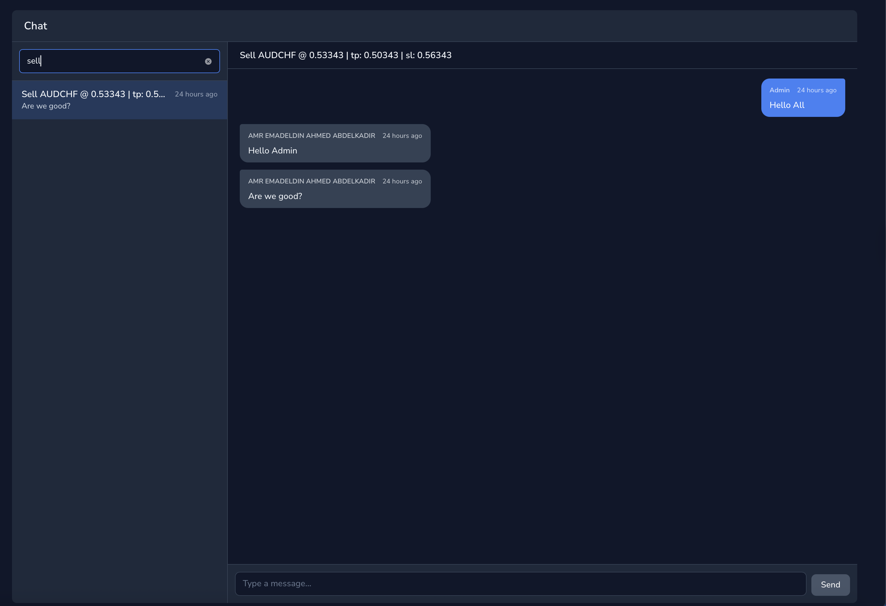

# asciisd/nova-chat

[](https://packagist.org/packages/asciisd/nova-chat)
[](https://packagist.org/packages/asciisd/nova-chat)
[](https://packagist.org/packages/asciisd/nova-chat)
[](LICENSE)

A reusable, contract-driven WhatsApp-style chat tool for Laravel Nova.

The package never assumes a single shared `chat_messages` table. Each project plugs in its own host model (a "topic"), its own message model, and its own author models. Everything connects through three small interfaces.


## Requirements

- PHP ^8.3
- Laravel Nova ^5.0

## Installation

```bash
composer require asciisd/nova-chat
php artisan vendor:publish --tag=nova-chat-config
php artisan migrate
```

The package ships its own auto-loaded migration for the
`nova_chat_blocked_participants` table that backs admin moderation —
no `vendor:publish` step is required for it.

Register the tool in `app/Providers/NovaServiceProvider.php`:

```php
public function tools(): array
{
    return [
        new \Asciisd\NovaChat\NovaChat,
    ];
}
```

Build the Vue bundle inside the package:

```bash
cd vendor/asciisd/nova-chat
npm install
npm run build
```

(If you're consuming via a path repo / monorepo, build inside the package source directory once and rebuild when you change Vue files.)

## How it works

The package provides three interfaces. Implement them on **your** models — the package never references domain classes directly.

### 1. The host model (the "thread")

```php
use Asciisd\NovaChat\Contracts\Chattable;
use Asciisd\NovaChat\Concerns\HasChat;

class Signal extends Model implements Chattable
{
    use HasChat;

    public function chatMessages(): HasMany
    {
        return $this->hasMany(SignalMessage::class);
    }

    public function chatTitle(): string     { return $this->title; }
    public function chatSubtitle(): ?string { return strtoupper($this->order_type); }
    public function chatBadge(): ?string    { return $this->status?->value; }
}
```

### 2. The message model

```php
use Asciisd\NovaChat\Contracts\ChatMessage;
use Asciisd\NovaChat\Concerns\AsChatMessage;

class SignalMessage extends Model implements ChatMessage
{
    use AsChatMessage;

    protected $fillable = ['signal_id', 'body', 'attachments', 'read_at', 'is_from_admin', 'author_type', 'author_id'];
    protected $casts    = ['attachments' => 'array', 'read_at' => 'datetime', 'is_from_admin' => 'bool'];

    public function chattable(): BelongsTo
    {
        return $this->belongsTo(Signal::class, 'signal_id');
    }
}
```

#### `is_from_admin` is auto-derived

You do **not** need to set `is_from_admin` yourself when inserting messages — the `AsChatMessage` trait fills it from the author at insert time:

```php
// From admin Nova UI (the package's own POST endpoint does this):
$signal->chatMessages()->create([
    'author_type' => $admin->getMorphClass(), 'author_id' => $admin->id,
    'body' => 'reply', 'is_from_admin' => true,   // explicit — kept
]);

// From your custom user-side endpoint:
$signal->chatMessages()->create([
    'author_type' => $user->getMorphClass(), 'author_id' => $user->id,
    'body' => 'question',                          // no is_from_admin → derived from $user->isChatAdmin()
]);
```

The trait only auto-derives when `is_from_admin` is **not** in the assigned attributes, so any value you explicitly pass is kept. Cost: one extra `SELECT` against the author table per `creating` event.

#### Required columns on your message table

| Column                       | Type                  | Notes                                                |
|------------------------------|-----------------------|------------------------------------------------------|
| `id`                         | bigint pk             | standard                                             |
| FK to host                   | bigint                | name is flexible (`signal_id`, `ticket_id`, …)       |
| `author_type` / `author_id`  | polymorphic morph     | `$table->morphs('author')`                           |
| `body`                       | text                  | message content                                      |
| `is_from_admin`              | bool, default `false` | set at write time; cheap unread queries              |
| `read_at`                    | timestamp nullable    | read receipts                                        |
| `created_at` / `updated_at`  | timestamps            | sidebar ordering + relative time                     |

Recommended optional: `reference` (ulid), `attachments` (json).

Recommended for moderation (required if you want soft-delete via the admin
endpoint): `deleted_at` (`$table->softDeletes()`), `deleted_by_type` /
`deleted_by_id` (`$table->nullableMorphs('deleted_by')`), and
`deletion_reason` (text nullable). Without `deleted_at` + the `SoftDeletes`
trait on your message model, `DELETE /messages/{id}` returns a 422 with an
actionable error.

Recommended indexes: `(fk, created_at)` and `(fk, is_from_admin, read_at)`.

A reference migration is shipped in `database/stubs/chat_messages_table.stub`,
and you can scaffold a fresh one in seconds:

```bash
php artisan nova-chat:make-table
# prompts for table name, host model class, and FK column
# writes database/migrations/<timestamp>_create_<table>_table.php
```

Pass arguments to skip the prompts:

```bash
php artisan nova-chat:make-table order_messages --host="App\\Models\\Order"
```

### 3. Author models (Admin / User / Customer / …)

```php
use Asciisd\NovaChat\Contracts\ChatParticipant;
use Asciisd\NovaChat\Concerns\AsChatParticipant;

class Admin extends Authenticatable implements ChatParticipant
{
    use AsChatParticipant;

    public function isChatAdmin(): bool { return true; }
}

class User extends Authenticatable implements ChatParticipant
{
    use AsChatParticipant; // isChatAdmin() defaults to false
}
```

### 4. Register the topic in `config/nova-chat.php`

```php
'admin_guard' => 'admin',

'morph_map' => [
    'admin'  => \App\Models\Admin::class,
    'user'   => \App\Models\User::class,
    'signal' => \App\Models\Signal::class,
],

'topics' => [
    'signal' => [
        'model'         => \App\Models\Signal::class,
        'message_model' => \App\Models\SignalMessage::class,
        'label'         => 'Signals',
        'icon'          => 'currency-dollar',
        'default'       => true,
    ],
],

'poll_interval_ms' => [
    'sidebar' => 4000,
    'thread'  => 3000,
],
```

Add more topics any time — the sidebar grows a tab switcher automatically.



The sidebar's search box filters by `title` and `reference` on whichever topic is active.

## API surface (admin auth required)

All routes live under `/nova-vendor/nova-chat/` and are protected by Nova's API middleware (which resolves the configured `admin_guard`):

| Method | Path                                                       |
|--------|------------------------------------------------------------|
| GET    | `/topics`                                                  |
| GET    | `/topics/{topic}/conversations`                            |
| GET    | `/topics/{topic}/conversations/{id}/messages`              |
| POST   | `/topics/{topic}/conversations/{id}/messages`              |
| DELETE | `/topics/{topic}/conversations/{id}/messages/{message}`    |
| POST   | `/topics/{topic}/conversations/{id}/read`                  |
| GET    | `/blocks`                                                  |
| POST   | `/blocks`                                                  |
| DELETE | `/blocks/{participant_type}/{participant_id}`              |

## Moderation


Two admin abilities, both opt-in via `config('nova-chat.moderation')`:

- **Block a participant globally.** Admins click "Block author" from any
  message bubble. The block is stored in the package-owned table
  `nova_chat_blocked_participants` and exposed on every `ChatParticipant`
  via `$user->isChatBlocked()`. The package's admin POST endpoint is
  unaffected (it only authors messages on behalf of admins) — your
  user-side write endpoint MUST gate on `isChatBlocked()` to actually
  enforce the block:

  ```php
  if ($user->isChatBlocked()) {
      abort(403, 'You have been blocked from chatting.');
  }
  ```

- **Soft-delete a user message.** Add `use Illuminate\Database\Eloquent\SoftDeletes;`
  to your message model and migrate a `deleted_at` column (the stub does
  this for new tables). Admins can then click "Delete message" on any
  bubble; the row is soft-deleted with `deleted_by_*` and `deletion_reason`
  recorded for audit. Admins continue to see the row grayed-out via
  `withTrashed()`; the consumer's user-side endpoint naturally hides it
  through the SoftDeletes global scope.

Both abilities can be turned off without a code change:

```php
'moderation' => [
    'allow_block'  => false,
    'allow_delete' => false,
],
```

## Laravel Boost integration

This package ships AI guidelines and skills for [Laravel Boost](https://laravel.com/docs/13.x/boost):

- `resources/boost/guidelines/nova-chat.md` — high-level conventions, always loaded when Boost detects the package.
- `resources/boost/skills/nova-chat-development/SKILL.md` — on-demand integration playbook (six-step walkthrough for adding a new Chattable host, troubleshooting matrix, API contract).

Run `php artisan boost:install` (or `boost:update --discover` after `composer require`) to publish them into the consuming app.

## v1 caveats

- **Polling only.** No Reverb/Pusher. Default cadence: sidebar 4 s, thread 3 s. Polling pauses while the tab is hidden.
- **Text only.** The `attachments` JSON column is preserved in the schema but not exposed in the v1 UI.

## License

MIT — see [LICENSE](LICENSE).
